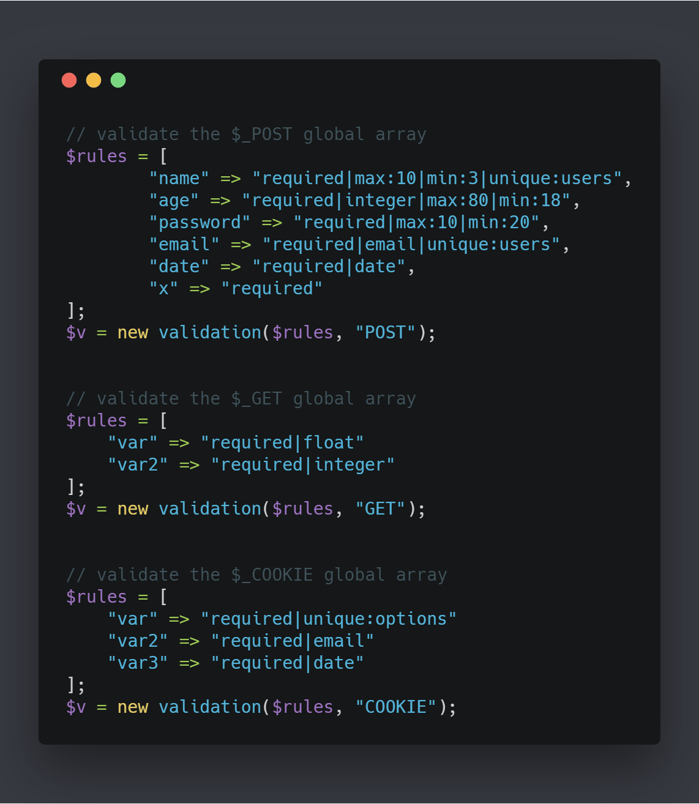
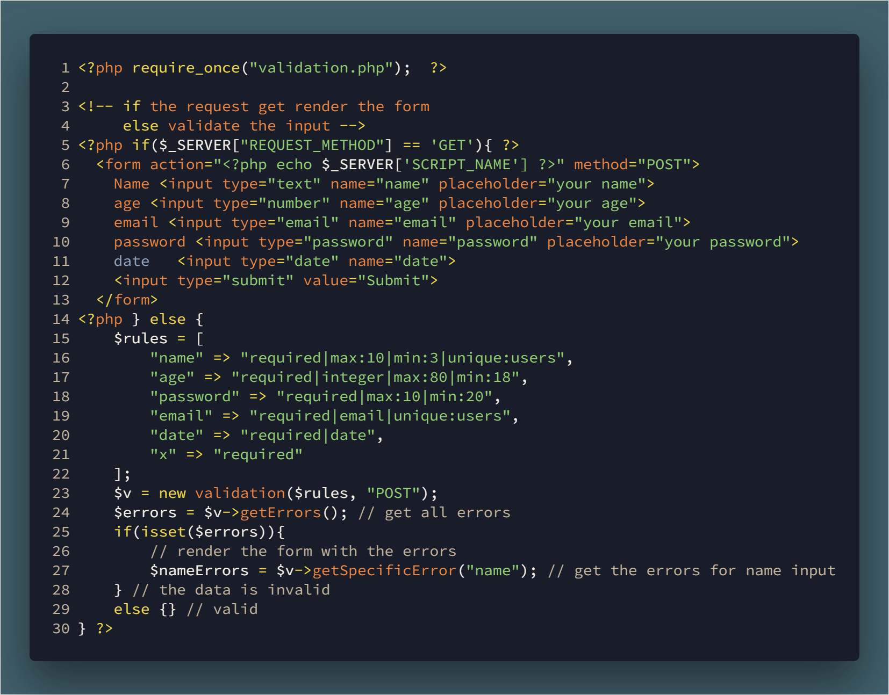

# Simple Validation class using PHP

[post](http://therealrowad.blogspot.com/2018/06/building-simple-validation-class-using.html)

### How to use 

### Usage


## Validation class 
### class definition and attributes
```php
<?php
class validation{
    private $data; // we will store the rules passed from the object initialized
    private $errors; // here we will store all the errors
    private $type; // determine the global array 
    private $holder; // to get the values from the array passed in case we need to use them
```
### __Construct
```php
    public function __construct($data, $type){
        $this->data = $data;
        // to change the global array 
        switch ($type) {
            case 'GET':
                $this->type = INPUT_GET;
                $this->holder = $_GET;
                break;
            case 'POST':
                $this->type = INPUT_POST;
                $this->holder = $_POST;
                break;
            case 'COOKIE':
                $this->type = INPUT_COOKIE;
                $this->holder = $_COOKIE;
                break;
            case 'SERVER':
                $this->type = INPUT_SERVER;
                $this->holder = $_SERVER;
                break;
            case 'ENV':
                $this->type = INPUT_ENV;
                $this->holder = $_ENV;
                break;
            default:
                break;
        }
        $this->extractRules($data);
    }
```
### extractRules method
```php
    // this function extract the rules and start the validate process based on each rule
    private function extractRules($data){
        foreach ($data as $name => $rules) {
            // explode split the string when ever | is found and store them as array in $theRules
            $theRules = explode('|', $rules); 
            $this->startValidation($name, $theRules);
        }
    }
```
### startValidation method
```php
    private function startValidation($name, $theRules){ // variable name & the rules as array
        foreach ($theRules as $rule) {
            // strpos return the postion of sub-string in the rule
            $min= strpos($rule, 'min'); // to find the min:10 in the rule
            $max = strpos($rule, 'max'); // to find the max:130 in the rule
            $unique = strpos($rule, 'unique'); // to find the unique in the rule
            if($min !== false){ // if found min 
                // min:20
                list($rule, $num) = explode(':', $rule); // we will use the list function to store min in $rule and 20 in $num
            }
            if($max !== false){
                // max:30
                list($rule, $num) = explode(':', $rule); // we will use the list function to store min in $rule and 30 in $num
            }
            if($unique !== false){ 
                // unique:TABLE_NAME
                list($rule, $tableName) = explode(':', $rule); // same idea storing the unique in the $rule and the table name in $tableName
            }
            // other rules does not need the previous code, switch is enough
            switch ($rule) {
                case 'required': 
                    $this->required($name);
                    break;
                case 'integer':
                    $this->isInteger($name);
                    break;
                case 'float':
                    $this->isFloat($name);
                    break;
                case 'email':
                    $this->isEmail($name);
                    break;
                case 'min':
                    $this->min($name, $num);
                    break;
                case 'max':
                    $this->max($name, $num);
                    break;
                case 'date':
                    $this->isDate($name);
                    break;
                case 'unique':
                    $this->unique($name, $tableName);
                    break;
                default:
                    break;
            }
        }
    }
```
### required mthod
```php
    private function required($varName){
        if(! filter_has_var($this->type, $varName)){ // if $varName does exist in the global array
            $this->errors[$varName][] = "{$varName} is required";
        }else {
            // if $varName exist in the global array
            // errors is array of arrays
            if(empty($this->holder[$varName])) $this->errors[$varName][] = "{$varName} is empty";
        } 
    }
```
### isInteger method
```php
    private function isInteger($varName){
        //  FALSE if the filter fails.
        //  NULL if the variable_name variable is not set. 
        $number = filter_input($this->type, $varName, FILTER_VALIDATE_INT);
        if($number === false || $number === null)
            $this->errors[$varName][] = "{$varName} is not an integer";
    }
```
### isFloat mtheod
```php
    private function isFloat($varName){
        //  FALSE if the filter fails.
        //  NULL if the variable_name variable is not set. 
        $number = filter_input($this->type, $varName, FILTER_VALIDATE_FLOAT);
        if($number === false || $number === null)
            $this->errors[$varName][] = "{$varName} is not float";    
    }
```
### isEmail 
```php
    private function isEmail($varName){
        //  FALSE if the filter fails.
        //  NULL if the variable_name variable is not set. 
        $email = filter_input($this->type, $varName, FILTER_VALIDATE_EMAIL);
        if($email === false || $email === null)
            $this->errors[$varName][] = "{$varName} is not an E-mail";   
    }
```
### min method
```php
    private function min($varName, $number){
        if(strlen(filter_input($this->type, $varName)) < $number)
            $this->errors[$varName][] = "{$varName} is < than {$number}";
    }
```
### max method
```php
    private function max($varName, $number){
        if(strlen(filter_input($this->type, $varName)) > $number)
            $this->errors[$varName][] = "{$varName} > than {$number}";
    }
```
### isDate method
```php
    private function isDate($varName){
        
        if(!$this->validateDate($this->holder["$varName"])){
            $this->errors[$varName][] = "{$varName} is not a date";
        }
    }
```
### validateDate method
```php
// from the documentation
    // you can add time to the format parameter
    private function validateDate($date, $format = 'Y-m-d'){
        $d = DateTime::createFromFormat($format, $date);
        // compare a dates format
        return $d && $d->format($format) == $date;
    }
```
### unique method 
```php
    // check if the data provided is in a table in the database
    // of course this will work better if the project have a database class the handle the errors and display them correctly
    public function unique($varName, $tableName){
        $mysqli = new mysqli("localhost", "root", "", "jupiter");
        if (mysqli_connect_errno()) {
            // there is no connection to the database,
            // print something 
            // or redirect the user
        }
        $q = $this->holder[$varName];
        $sql = "SELECT {$varName} FROM {$tableName} WHERE {$varName} = ?";
        if ($stmt = $mysqli->prepare($sql)) {
            
            $stmt->bind_param("s", $q);

            $stmt->execute();
            
            /* bind result variables */
            $stmt->bind_result($col);
            /* fetch value */
            $stmt->fetch();
            // if we found the same data inside the database
            if(isset($col)) $this->errors[$varName][] = "{$q} is not a unique in the {$tableName} table";
            
            $stmt->close();
        }

        /* close connection */
        $mysqli->close();
    }
```
### printErrors method
```php
    // to print the errors in a good format
    private function printErrors(){
        print "<pre>";
        print_r($this->errors);
        print "</pre>";
    }
```
### __destruct  magic method
```php
    public function __destruct(){
        $this->printErrors();
    }
```
### getErrors method
```php 
    // to get all errors
    public function getErrors(){
        return $this->errors;
    }
```
### getSpecificError method
```php
    // to get specific error
    public function getSpecificError($name){
        return isset($this->errors[$name]) ? $this->errors[$name] : null;
    }
```